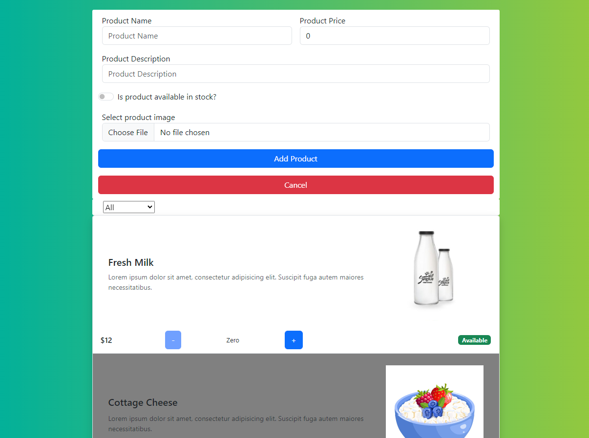

<h1>Grocery List</h1>

 
  
   

<!-- TABLE OF CONTENTS -->

# 📗 Table of Contents

- [📖 About the Project](#about-project)
  - [🛠 Built With](#built-with)
    - [Tech Stack](#tech-stack)
    - [Key Features](#key-features)
  - [🚀 Live Demo](#live-demo)
- [💻 Getting Started](#getting-started)
  - [Setup](#setup)
  - [Prerequisites](#prerequisites)
  - [Install](#install)
  - [Usage](#usage)
  - [Run tests](#run-tests)
  - [Deployment](#deployment)
- [👥 Authors](#authors)
- [🤝 Contributing](#contributing)
- [⭐️ Show your support](#support)
- [🙏 Acknowledgements](#acknowledgements)
- [📝 License](#license)

<!-- PROJECT DESCRIPTION -->

# 📖 Grocery List

**Grocery List Template**  is a React single-page Application, Built using CRA, It has pre-inserted grocery items and you can add more using the form at the top of the list you can also filter the list to display available or unavailable items only.

## 🛠 Built With 

### Tech Stack 

  
Languages &  bundlers

  <ul>
    <li>JSX</li>
    <li>ES6</li>
    <li>React</li>
  </ul>

  
Server

  <ul>
    <li>Render</li>
  </ul>

Database

  <ul>
    <li>-</li>
  </ul>

<!-- Features -->

### Key Features 

- **Single page application.**
- **Use React.**

(<a href="#readme-top">back to top</a>)

<!-- LIVE DEMO -->

## 🚀 Live Demo 

- [Hosted on Render](https://render.com/)

(<a href="#readme-top">back to top</a>)

<!-- GETTING STARTED -->

## 💻 Getting Started 

To get a local copy up and running, follow these steps.

### Prerequisites

In order to run this project you need:

- Install Node.js.
- Visual Studio Code or equivalent. 
- Internet Browser.

### Setup

Clone this repository to your desired folder:

- cd my-folder
- git clone [https://github.com/hernandanielzamora/Javascript-Capstone.git](https://github.com/hernandanielzamora/Javascript-Capstone.git)

### Install

Install this project with the following:

- cd my-project
- git config --global --add safe.directory my-directory/my-folder/my-project
 
### Usage

To run the project, execute the following command:

- code .
- npm install
- npm start

### Run tests

To run tests, run the following command:

npm test

### Deployment

You can deploy this project using:

- render.com

(<a href="#readme-top">back to top</a>)

<!-- AUTHORS -->

## 👥 Authors 

👤 Abdelaziz Ali

- GitHub: [@Abdelaziz-Ali](https://github.com/Abdelaziz-Ali)
- Twitter: [@AbdelazizDV](https://twitter.com/AbdelazizDV)
- LinkedIn: [in/abdelaziz-mahdi](https://www.linkedin.com/in/abdelaziz-mahdi)

(<a href="#readme-top">back to top</a>)

## 🤝 Contributing 

Contributions, issues, and feature requests are welcome!

(<a href="#readme-top">back to top</a>)

## ⭐️ Show your support 

Give a ⭐️ if you like this project!

(<a href="#readme-top">back to top</a>)

## 🙏 Acknowledgments 

Template used in the project provided by ([Procademy](https://www.youtube.com/@procademy))!

(<a href="#readme-top">back to top</a>)

## 📝 License 

This project is [MIT](./LICENSE) licensed.

(<a href="#readme-top">back to top</a>)

